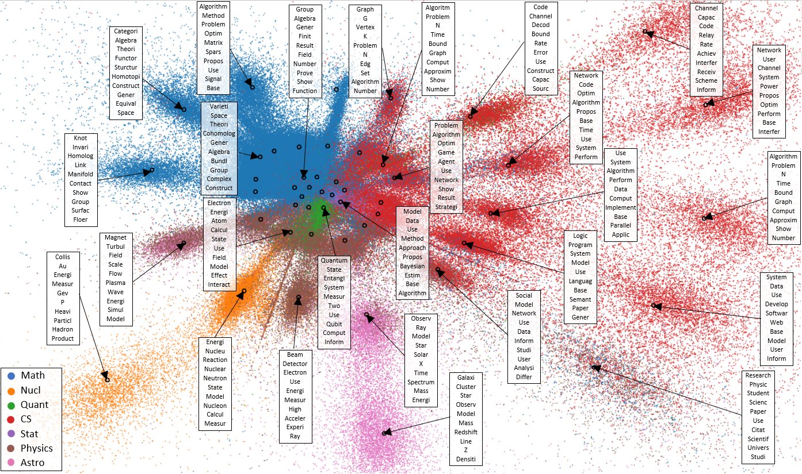

# PLSV-VAE 
Pytorch Implementation of [Auto-Encoding Variational Bayes for Inferring Topics and Visualization](https://arxiv.org/abs/2010.09233)

## Train
Python version: 3.6, Pytorch version: 1.2.0.

To train the plsvVAE model:
```bash
python train.py -e 1000 -dist gaussian
```
Available distance functions: gaussian, multi_quadratic, and inverse_quadratic.

To train your own dataset:

* Preprocess your dataset (use your own preprocessing functions or use our preprocessing function in data_preprocessing.py).
* Vectorize train data (for large dataset, to avoid memory problem, we recommend using gensim instead of CountVectorizer of sklearn).
* Run train.py script.
## Example
* train_nb.ipynb: Training example with top words and visualization on REUTERS dataset.
* Example on arxiv dataset with top-10 topic words:


## Credit
I started from a fork of this [repo](https://github.com/hyqneuron/pytorch-avitm.git).

## Citing
If you use the data or the model, please cite,
```
@inproceedings{pham2020auto,
  title={Auto-Encoding Variational Bayes for Inferring Topics and Visualization},
  author={Pham, Dang and Le, Tuan},
  booktitle={Proceedings of the 28th International Conference on Computational Linguistics},
  year={2020}
}
```
